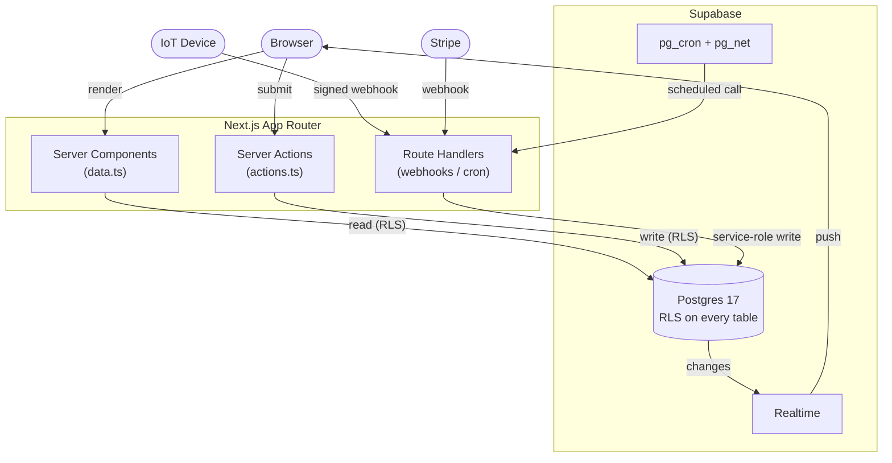
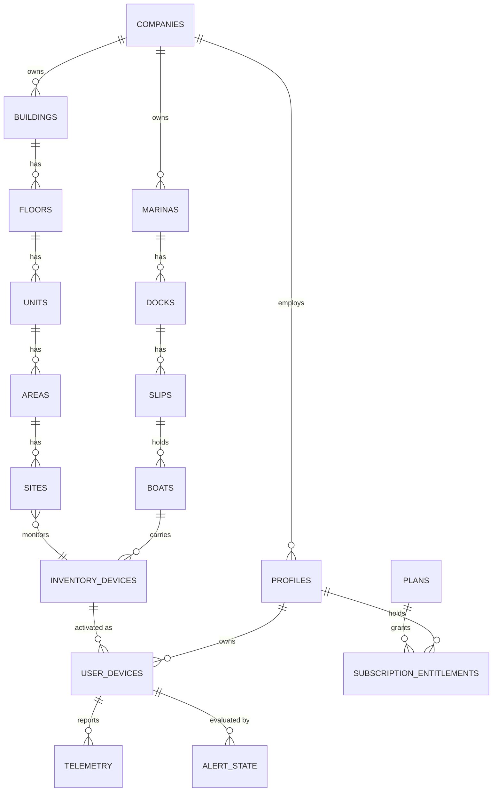
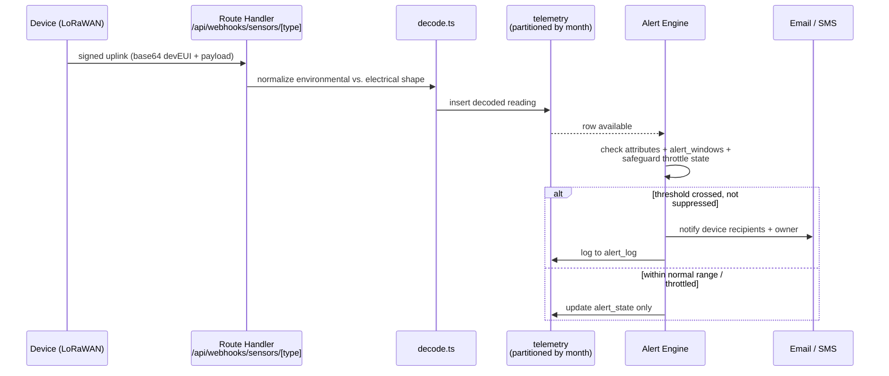

# AssetGrid

**IoT asset management, reimagined on Next.js 16 + Supabase.** AssetGrid monitors connected sensors and devices across three physical domains — automated buildings, marina/boat fleets, and general inventory — and wraps them in a CRM, a device storefront, and Stripe-backed billing. It's a from-scratch rebuild of a production Laravel + MySQL/MongoDB platform, migrated to a modern, fully type-safe, RLS-first stack.

     

---

### Contents

[What this is](#what-this-is) · [At a glance](#at-a-glance) · [Architecture](#architecture) · [Data model](#the-data-model) · [IoT packet handling](#iot-telemetry--packet-handling) · [Scale](#built-for-millions-of-rows-not-thousands) · [Security](#security-row-level-security-is-the-authorization-system) · [Typing](#strong-typing-end-to-end) · [Getting started](#getting-started)

## What this is

A tenant (a company) onboards IoT devices — temperature/humidity sensors, smart charging outlets, bilge and water-leak monitors, generator and power monitors, motion sensors — and assigns them to a physical location: a room inside a monitored building, or a boat in a marina slip. Devices report over LoRaWAN; every packet is decoded, stored, and evaluated against alert rules in real time. On top of that sits everything a company needs to actually run the business: a CRM for customers, a device catalog/storefront, Stripe-backed subscriptions and one-time device activation, role-based access control, and a full marina property-management module (reservations → quotes → contracts → invoices → ledgers).

It's built for **portfolio purposes** — the working system is real, the code is real, but it runs on a synthetic dataset (no real customer data anywhere in the app or its history).

## At a glance

| | |
|---|---|
| **Data model** | 118 Postgres tables, generated TypeScript types, zero hand-maintained schema drift |
| **Security** | 140 Row-Level Security policies, 7 reusable auth functions — the database enforces access, not the app |
| **Scale** | `telemetry` range-partitioned by month (41 partitions); legacy system logged ~9.5M readings |
| **Automation** | 5 `pg_cron` jobs (30s–monthly) drive charging control, health sweeps, PMS maintenance, partition roll-forward |
| **Type safety** | Strict TypeScript, zero `any`, Zod validation on every Server Action input |
| **Architecture** | No REST layer — Server Components read, Server Actions write, RLS authorizes |

## Architecture

**Next.js App Router, server-first.** Every list/detail page is a Server Component reading directly from Supabase with the request's own JWT, so **Postgres Row-Level Security does the authorization, not the route handler.** Mutations are Server Actions, not a REST layer — no client-side fetch waterfalls, no API versioning to maintain.



A strict three-layer split, enforced by convention across every domain (`buildings`, `devices`, `marina`, `billing`, `catalog`, `roles`, …):

```
lib/<domain>/data.ts      Server Components read here. import 'server-only'.
                           Returns typed, camelCase DTOs. RLS scopes every query —
                           no manual "if user.role === 'admin'" branching.

lib/<domain>/actions.ts   Server Actions. requirePermission(module, action) first,
                           Zod-validate the input, return { ok, error?, fieldErrors? },
                           revalidatePath() on success.

app/app/<domain>/         Pages, gated again at the route level
                           (requirePagePermission → 404 on deny, not a redirect
                           that leaks that the resource exists).
```

System-initiated writes that span multiple tables — a Stripe webhook, device activation, the ETL, a scheduled job — go through a **service-role client that bypasses RLS**, with the permission check made explicit in the calling code instead. User-initiated writes that must be atomic (booking a marina reservation across `reservations` + `invoices` + `ledgers`) go through a `SECURITY INVOKER` Postgres function instead, so the caller's own RLS still applies *inside* the transaction.

## The data model

**118 tables** in Postgres 17, organized by domain: identity & RBAC, device inventory & activation, buildings (building → floor → unit → area → site), marina (marina → dock → slip → boat, plus a full PMS pipeline: reservations, quotes, contracts, stays, POS, invoices, ledgers), billing (Stripe-synced plans, entitlements, payments), messaging (SMS groups, broadcast, outbox), and the alerting/notification engine. Simplified to the core relationships:



Types are never hand-maintained: `lib/database.types.ts` is generated straight from the live schema (`supabase gen types typescript`), so a migration that renames a column is a compile error everywhere it's used, not a runtime surprise.

## IoT telemetry & packet handling

Sensors post signed LoRaWAN uplinks to `/api/webhooks/sensors/[type]`. `lib/telemetry/decode.ts` normalizes two distinct packet shapes into one row, then the same request evaluates it against the device's alert rules before responding:



- **Environmental** (temperature/humidity/reed-contact/PIR/battery) — flat keys.
- **Electrical** (smart chargers/relays) — nested `objectJSON.data`: consumed/elapsed energy, real/apparent/reactive power, power factor, voltage/current, relay state.

`devEUI` and the gateway ID arrive base64-encoded and are decoded to upper-hex before the row is written. The **alerting engine** (`lib/alerts/engine.ts`) evaluates the device's threshold rules (`attributes` catalog), applies suppression windows (`alert_windows`) and a per-device throttle state machine (`safeguard_configurations` + `alert_state`) to stop alert storms, then fans notifications out over email/SMS and logs every send to `alert_log` — so "what did the system actually notify, and why" is always answerable after the fact, not just "what did it currently think."

## Built for millions of rows, not thousands

Telemetry is the highest-volume table in the system by a wide margin — the legacy platform this replaced had logged **~9.5M raw readings** across its lifetime. `telemetry` is **range-partitioned by month** (41 partitions currently provisioned, into 2027), with a `pg_cron` job (`telemetry-partition-maintenance`) rolling a new partition forward automatically — so `INSERT`s and time-window queries stay fast indefinitely without a manual DBA step. The ETL that migrated the legacy dataset (`scripts/etl/`) streams MySQL + MongoDB sources through Node in batches rather than loading them into memory, is fully idempotent (safe to re-run), and ships its own reconciliation report (`verify.ts`) that diffs row counts and checksums old vs. new — not "it looked right," a script that proves it.

Five other `pg_cron` jobs run against the live database on their own schedule (30s–monthly), calling back into the app's own Next.js Route Handlers via `pg_net` rather than standing up duplicate Postgres Edge Functions: device charging control, fleet health sweeps, marina PMS maintenance, stale-activation cleanup, and the partition roll-forward above.

## Security: Row-Level Security is the authorization system

**140 RLS policies** across the schema — every table denies by default; a policy has to explicitly grant a role access. Authorization logic lives in **7 reusable Postgres functions**, not duplicated per-policy:

| Function | Used for |
|---|---|
| `auth_is_super_admin()` | Blanket bypass for the platform-admin role |
| `auth_can(module, action)` | Permission-matrix check (`role_permissions`) |
| `auth_owns_user_device(id)` | A customer can only ever see their own devices |
| `auth_scope_allows(entity, id)` | Data-scoped roles (a manager scoped to *this* building, not all of them) |
| `auth_scope_grant_allowed(...)` | A non-super-admin can only *grant* access they themselves hold |
| `auth_is_customer()` / `auth_role_title()` | Role-aware policy branches |

A device's telemetry, for example, is readable if — and only if — the caller is a super admin, **or** owns the user-device it came from, **or** holds `inventory:read` scoped to that specific device. That's the entire authorization surface for the table: one Postgres policy, evaluated by the database itself on every query, impossible to accidentally bypass from application code.

## Strong typing, end to end

TypeScript strict mode, zero `any` in application code, generated Postgres types flowing all the way to the UI. Every Server Action validates its input with **Zod** (used across 16 modules) before it touches the database — malformed input never reaches a query. PostgREST's own type-narrowing quirks (a `.select()` must be a single string literal; disambiguating an embed when two foreign keys point at the same table) are handled once, in the data layer, not re-solved per call site.

## Also in the box

- **Stripe billing** — checkout, webhooks (signature-verified, deduplicated via `stripe_events`), and entitlement provisioning, fully wired in test mode.
- **RBAC** with per-module, per-action permissions and data-scoped grants (a manager who can only manage *their* building).
- **Impersonation** ("log in as this user") with a signed, time-boxed ticket and a full audit log.
- **Realtime** — `telemetry` and `alert_state` are on Supabase's realtime publication for live dashboards.
- **Bulk CSV import**, **PDF contract generation** (`@react-pdf/renderer`), **SMS broadcast groups**, and a marina reservation pipeline atomic enough to double-book-proof a slip.
- **Hand-built data visualization** (`components/charts/`) — SVG bar/line charts and stat tiles, no charting library, built to a documented accessibility/color-contrast standard rather than defaults.

## Getting started

```bash
npm install
cp .env.example .env        # fill in your Supabase + Stripe keys
npm run dev
```

Migrations live in `supabase/migrations/`, applied with `supabase db push`. Regenerate types after any schema change:

```bash
npx supabase gen types typescript --db-url "$SUPABASE_DB_URL_POOLER" --schema public > lib/database.types.ts
```

## Project structure

```
app/app/<domain>/        Pages (Server Components + a page-level permission gate)
app/api/                 Webhooks + internal cron-invoked routes only —
                          everything else is a Server Action, not a REST endpoint
lib/<domain>/            data.ts (reads) / actions.ts (writes) per domain
lib/telemetry/           LoRaWAN packet decoding + time-series reads
lib/alerts/               Rule evaluation + notification fan-out
components/charts/       Hand-built SVG data-viz (bar/line/stat-tile) —
                          no charting library dependency
components/ui/           shadcn v4 (Base UI primitives)
supabase/migrations/     Every schema change, applied in order
scripts/etl/             The legacy-system migration pipeline (Node, streaming)
```

---

*A portfolio project — architecture and code are real and fully functional; the data behind it is synthetic.*
